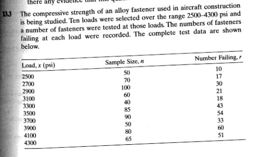

# MANE 6399 - Data Science

## Homework 7 - Logistic Regression

### Assigned: April 2, 2020
### Due: April 10, 2020

Consider the problem and the data shown below.

#### Problem 1

Construct a data frame and generate a plot of load versus failure/success.

#### Problem 2

Fit a logistic regression model and clearly identify the values of the parameters using Scikit Learn. Prepare plot that include the fitted values.

#### Problem 3

Perform a hypothesis test to determine if the model is statistical significant. Report the value of $G$, the critical value when $\alpha=0.05$ and the p-value for this test.

#### Problem 4

What is the probability of a fastener failing when $psi=4000$?

#### Problem 5

What is the odds ratio when $psi=4000$?
